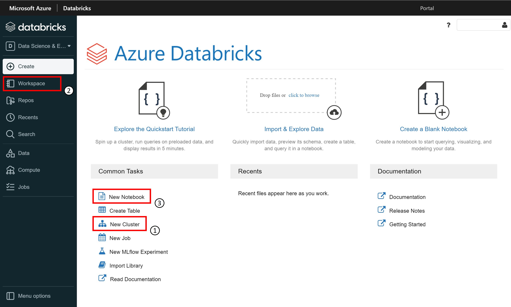

# Get started with Azure Databricks

Azure Databricks is a Microsoft analytics service. It offers an integration between Microsoft Azure and Apache Spark's Databrick implementation.

## Understand Azure databricks

Azure Databricks runs on top of a proprietary data processing engine called **Databricks Runtime**, an optimized version of Apache Spark.

In a nutshell: Azure Databricks offers a fast, easy and collaborative Spark based analytics service. Accelerate big data analytics, artificial intelligence, performat data lakes, interactive data science, machine learning, and collaboration.

## Main concepts in Azure Databricks

1. The **cluster**: a set of computational resouces on which we run the code
2. The **workspace**: groups all the Databricks elements, clusters, notebooks, data
3. The **notebook**: a document that contains runnable code, descriptive text, and visualizations

## Provision Azure Databricks workspaces and clusters

**Workspace**: environment for accessing all Databricks elements. Each user has a home folder for their notebooks and libraries.
- Groups objects: notebooks, libraries, experiments
- Access to data
- Access to computational resources: clusters, jobs

**Cluster**: computational resources on which you run the code (as notebooks or jobs). ETL pipelines, machine learning, data science, analytics workloads can be run on the cluster
- All-purpose cluster: multiple user can share such cluster to do collaborative interactive analysis
- Job cluster: to run a specific job and will be terminated when the job is completed.

**Runtimes**: the set of core components that run on Azure Databricks clusters.
- **Databricks Runtime**: includes Apache Spark, components and updates that optimize the usability, performance and security for big data analytics.
- **Databricks Runtime for Machine Learning**: a variant that adds multiple machine learning libraries such as TensorFlow, Keras and PyTorch
- **Databricks Light**: for jobs that don't need the advanced performance, reliability or autoscaling of Databricks Runtime

A cluster can be customzied in many ways. Third party code can be installed via many sources such as PyPI or Maven.

## Working with data in a workspace

An Azure Databricks database is a collection of tables. An Azure Databricks table is a collection of structured data.

We can cache, filter, and perform any operations supported by Apache Spark Dataframes on Azure Databricks tables. We can query tables with Spark APIs and SparkSQL

To access:
- Import file to DBFS using UI via FileStore or create table
- Mount and use supported data sources via DBFS

**Importing data**: Upload from local, use already existed under DBFS and mount external sources like Azure Storage, Azure Data Lake. Data will be available as a table or a mount point under the DBFS file system `/FileStore`

## Using DBFS mounted data

Databricks File System is a distributed file system mounted into Databricks workspace and available on Databricks cluster

- Allow mounting storage objects for access without any credentials?
- Allow interaction with storage object using directory and file schematics instead of storage URLs
- Persist file into object storage so that they are not lost when terminate a cluster

## Work with notebooks in Azure Databricks

Web-based interface that contains
- Runnable code
- Descriptive text
- Visualization

Supported language: Python, Scala, R, SQL. Language of a cell can be overrided using command `%<language>`

Other magic command:
- `%sh`: run shell code
- `%fs`: dbutils filesystem command
- `%md`: include various type of documentation including text, images, math formulars and equations.

## Summary

- Describe main concepts in Azure Databricks
- Work with workspaces and clusters
- Work with notebooks