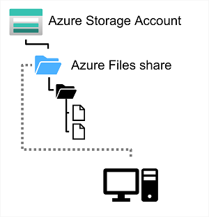
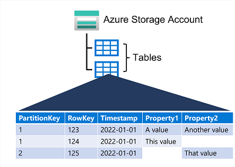

# Explore Azure storage for non-relational data

## Explore Azure blob storage

**Azure Blob Storage** is a service that enables storing of massive amounts of unstructured data as Binary Large Objects (blobs) on the cloud.

In an Azure Storage account, blobs is stored in *containers* that provides a convenient way of grouping related blobs together. Read and write access can be controled at container level. Within a container there are virtual folders that are meant for organize only and **does not have access control or bulk operation**.

**Azure Blob Storage** supports 3 different types of blob:
- **Block blobs**: handled as a set of blocks. Each blocks can vary in size, up to 100MB, and can contains up to 50000 blocks giving a maximum size of 4.7TB. A **block** is the smallest amount of data that can be read or written as an individual unit. **Best used for storing discrete, large, binary objects that change infrequently.**
- **Page blobs**: organized as a collection of fixed size 512-bytes page, optimized to support random reads and writes. A page blobs can store up to 8TB of data. Azure use Page Blobs to implement virtual disks for VM.
-**Append blobs**: optimized to support append operations. Blocks can only be add to the end of an append blobs, updating or deleting existing blocks isn't supported. Each block can vary in size, up to 4MB. Maximum size of append blob is just over 195GB.

Blob storage provides 3 acces tier:
- **Hot**: default tier, used for frequently accessed data. Data is stored on high performance media.
- **Cool**: lower performance but cheaper price.
- **Archive**: use for historical data that cannot be lost, but are not used. It have the lowest cost and need to be *rehydrated* to Cool or Hot tier to be used (can takes up to hours). Data is stored on offline media.

Blobs can have lifecycle policies based on the last days since modification that can move them between tiers or delete blobs.

## Explore Azure Data Lake Storage Gen2

**Azure Data Lake Storage (Gen1)** is a separate service for hierarchical data storage for analytical data lakes, often used by big data analytical solution to work with structured, semi-structured and un-structured data stored in files.

**Azure Data Lake Storage Gen 2** is a newer version of the above that integrated into Azure Storage, enabling the advantages of scalability of blob storage and cost-control of storage tiers combine with hierarchical file system capability and compatibility with major analytics systems of Azure Data Lake Store.

System like Hadoop in Azure HDInsight, **Azure Databricks**, Azure Synapse Analytics can mounts a distributed file system hosted in ADLS Gen 2 and use it to process huge volume of data.

To enable ADLS2 files system, **Hierarchical Namespace** option for Azure Storage Account have to be enabled. It is a one-way conversion and after enabled, the Storage Account cannot be revert back to flat namespace.

## Explore Azure Files

**Azure Files** is a cloud-based network shares (like local area network file share). Eliminate hardware cost and maintainace overhead, and benefits from high availability and scalable cloud storage for files.

Azure files can be created in a storage account, and enable up to 100TB of data in a single storage account, and data can be distribued across any number of file shares. Max size of a single file is 1TB. Up to 2000 concurrent connections per shared file is supported.

File can be uploaded through Azure portal or using AzCopy utility. Azure File Sync service can also be used to synchronize locally cache copies of shared files with the data in Azure File Storage.

Azure Files offer 2 performance tier, Standard uses hard-disk based hardware, Premium tier uses solid-state disks.

Azure Files support 2 common network file sharing protocols:
- Server message block (SMB): sharing accoss multiple platform
- Network File System (NFS): used by some macOS and Linux. NFS need a premium tier storage account and configure a virtual network.

## Explore Azure Tables

**Azure Tables** is a NoSQL storage solution that makes use of tables containing key-values data items. Each item is represented by a row that contains columns for the data fields that need to be stored.

Azure Tables enables you to store semi-structured data. All rows need to have a unique key (composed of a partition key and a row key), and when a row is modified, a timestamp column records the date and time of the modification. Data is often denormalized in these table.

Tables are splits into partition to ensure scalability and performance. It is a mechanism to group related row based on a comon property or partition key.

Paritition are independent from each other, can grow and sink as rows are added and removed. A table can contain any number of partition. Using partition key can help reduce I/O and time when search for data.

Row key are unique inside a partition, and items in a partition are stored in row key order. Point and Range query within a partition can be quicky executed.

## Summary

Describe features and capabilities of
- Azure Blob Storage
- Azure Data Lake Gen2
- Azure Files
- Azure Tables
