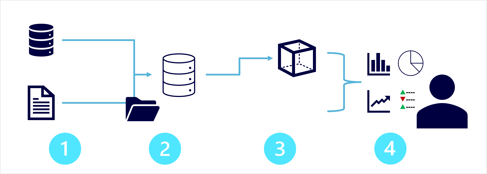
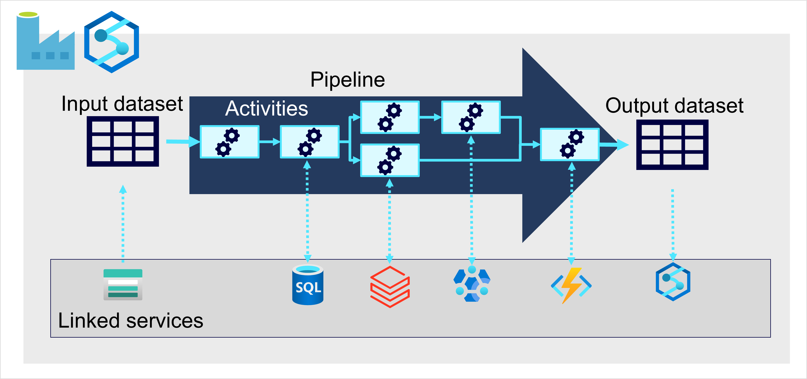

# Explore fundamentals of modern data warehousing

## Describe modern data warehousing

1. **Data ingestion and processing**: data from one or more transactional data stores, files, streams and others are loaded into a data lake or relational data warehouse. Often involves ETL or ELT processes and performed by distributed system that can process high volume of data in parallel computing nodes. 
2. **Analytical data store**: data stores for large scale analytics include relational data warehouses, file-system based data lakes, and hybrid architectures that combines both (sometime called lakehouse or lake datahouse).
3. **Analytical data model**: it is common to create data model that pre-aggregate the data to make it easier to produce reports, dashboard and interactive visualization. These data model often described as cube, in which numerical data valus are agregated across one or more dimension. 
4. **Data visualization**: data analyst can produce reports, dashboards and visualizations. Additionally, users in organization which is not technology professionals might perform self-service data analysis and reporting.

## Explore data ingestion pipelines

On Azure, large-scale data ingestion is best implemented by creating pipelines that orchestrate ETL processes. Pipelines can be created and run using Azure Data Factory or Azure Synapse Analytics.

Pipelines consists of one or more activities that operate on data. Pipelines used linked services to load and process data, enabling the right technology for each step.

## Explore analytical data stores

There are 2 common types of analytical data store:
- **Data warehouse**: is a relational database which data is stored in a schema that is optimized for data analytics rather than transactional workloads. Data warehouse is great choice when there is transactional data that can be organized into a structured schema of tables.
- **Data lake**: is a file store, often on distributed system for high performance data access. Spark and Hadoop often used to process queries on stored files and return data for reporting and analytics. These systems often apply *schema-on-read* approach to define tabular schema on semitructured files. Data lakes is great for supporting a mix of structured, semi-structured and un-structured data that need to be analized without schema enforcement on writes.
- **Hybrid**: combines fetures of both data warehouse and data lakes, where data is stored as files in data lakes and abstraction layer expose them as table which allows queries using SQL. Example includes PolyBase in Azure Synapse Analytics and Delta Lake in Azure Databricks.

Azure service for analytical stores:
1. Azure Synapse Analytics: unified, end-to-end solution for large scale data analytics, combine the data integrity and reliability of scalable high performance SQL server based relational data warehouse with the flexibility of data lake and open sourced Apache Spark.
2. Azure Databricks: implementation of the popular Databricks platform. Offers native SQL capabilities and workload-optimized Spark cluster for data analytics and science. Suitable for reusing experise or operate in multi-cloud platform
3. Azure HDInsight: supports multiple open-sourced data analytics cluster types. Not as user friendly as the above, but suitable if the solutions relies on multiple open-sourced framework or an existing on-premises Hadoop based solution need to be migrated to the cloud.

## Summary

- Identify common elements of a modern data warehousing solution
- Describe key features for data ingestion pipelines
- Identify common types of analytical data store and related Azure services