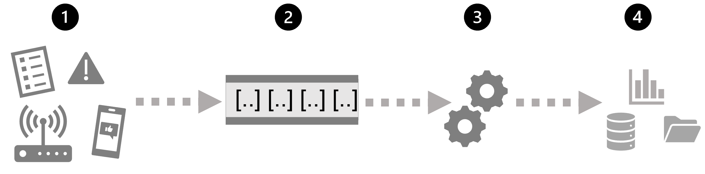

# Expore fundamental stream processing

## Understand batch and stream processing

Data processing is conversion of raw data into meaningful information.
- Batch processing: multiple records are collected and stored before being processed together in a single operation.
- Stream processing: a source of data is constantly monitored and processed in realtime as new data is generated.

**Batch processing**: new data is collected and stored and the whole group is processed together, often intervally (every hour, days, ...) or after a certain amount of data have been collected (1000 records, ...)
- Advantages: large volume of data can be processed at a convenient time
- Disadvantages: time delay between ingestion and result, prone to data errors and program crashes

**Stream processing**: new data is processed as they arrive. Ideal for system that need instant response.

Other differences:
||Batch | Stream|
|---|---|---|
| Data scope | All data | Only most recent or within a rolling window|
| Data size | Large datasets | Individual records or micro-batches |
| Performance (Latency) | A few hour | Microseconds |
| Analysis | Complex analysis | Simple response function |

Combine batch and stream processing:
- Enable both historical and realtime data analysis
- Streaming technologies often used to capture real-time data and store it in a data store for subsequent batch processing

1. Data events from streaming data source
2. Data from other sources is stored in a data store
3. Captured streaming data is written to the data store
4. Streaming data is prepared for analytics and visualization
5. Data from data store is processed via batch processing and save to data warehouse
6. Result from stream is saved to data warehouse
7. Analytical and Visualization used to explore and present real-time and historical data

## Explore common elements of stream processing architecture

1. An event generate some data
2. The data is captured in some streaming source
3. The data is fetch from the source and processed
4. The result from processing is saved to a sink that can be a data store or another source for further downstream processing

**Real-time analytics in Azure**:
- Azure stream analytics: a PaaS solution where streaming jobs can be definded which ingest data from a streaming source, apply a perpetual query and write the result to an output
- Spark structured streaming: an open source library that enables complex streaming solution based on Spark services (including Synapse, Databricks, HDInsight)
- Azure Data explorer: a high performance database and analytics service that is optimized for ingesting and querying batch or streaming data with a time-series elements

**Sources for stream processing**:
- Azure Event Hubs: a data ingestion service where queues of event data can be managed, ensuring each event is processed in order, exactly once.
- Azure IoT Hub: a data ingestion service that is similar to Event Hubs but is optimized for managing event data from IoT devices
- Azure Data Lake Store Gen2: a highly scalable storage service that can be used as a source for streaming data
- Apache Kafka: open source data ingestion solution that is commonly used together with Spark. Azure HDInsight can be used to create a Kafka cluster

**Sinks for stream processing**:
- Azure Event Hubs: queue the processed data for further processing
- Azure Data Lake Store Gen2 or Azure Blob Storage: used to persist the result as a file
- Azure SQL Database or Azure Synapase Analytics or Azure Databricks: used to persist the results in a database table for querying and analysis
- Microsoft PowerBI: generate realtime data visualization in reports and dashboards

## Explore Azure Stream Analytics

**Azure Stream Analytics** is a service for complex event processing and analysis of streaming data:
- Ingest data from a source
- Process data using a query to select, project and aggregate
- Write results to a sink

Once started, a Stream Analytics query will run perpetually. It is a great technology for continuous filtering and aggregation of data to store or pass downstream.

To use Stream Analytics, create a Stream Analytics **job** in the Azure subscription, configure the source/sink and define the query.

If the job is complex or resource intensive, a Stream Analytics **cluster** can be used.

## Explore Apache Spark on Azure

Spark can be found in the following service;
- Azure Synapse Analytics
- Azure Databricks
- Azure HDInsight

**Spark Strucutred Streaming**: a API in Spark which allow ingestion, processing and save the result from streams of data. Spark Streaming is great choice for real time analytics where streaming data need to be incorprated into Spark based data lake or analytical store.

**Delta lake**: is an open source layer that add support for transactional consistency, schema enforcement and other common data warehousing feature. Relational tables in Delta lake can be used for both batch and stream processing. Delta lake combine with Spark structured streaming 

